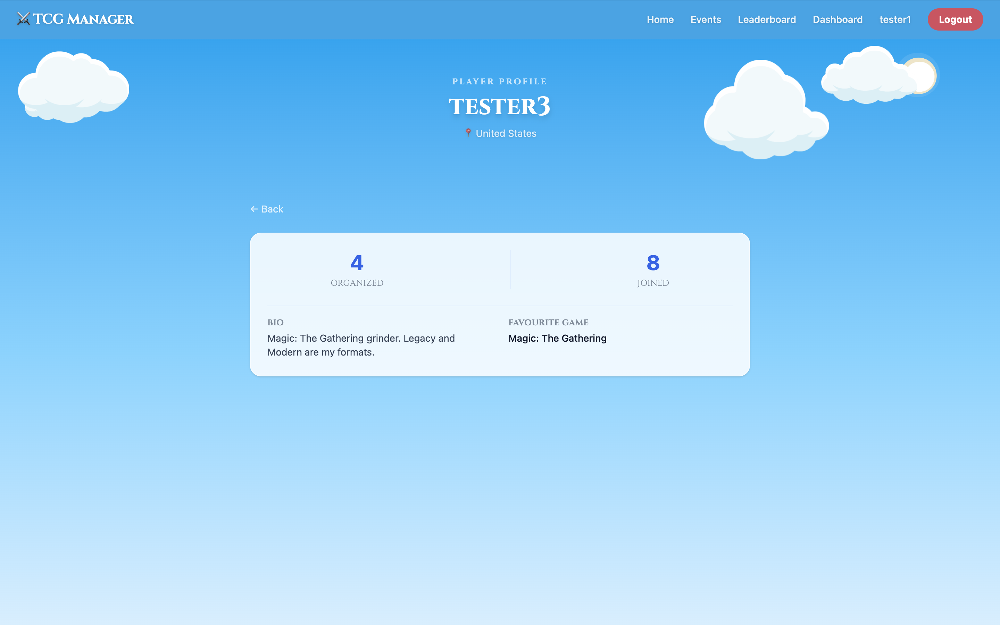
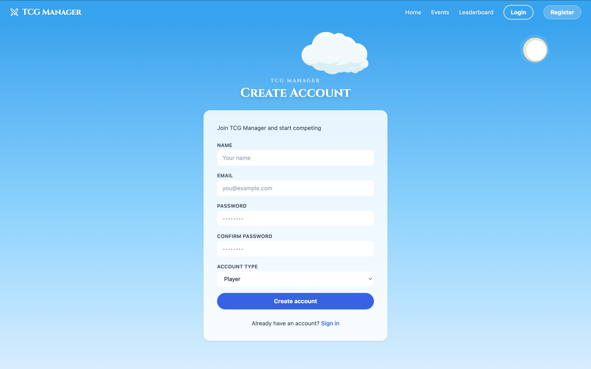

# TCGManager — React Frontend


**TCGManager** is a full-featured single-page application for organizing and joining Trading Card Game tournaments. Built with **React 19 + Vite 8 + Tailwind CSS v4**, it consumes a REST API built in Laravel 13.

Developed as part of **Sprint 5 — IT Academy Barcelona**, using **Claude (Anthropic)** as AI assistant throughout the development process.

---

## Links

- 🚀 **Live demo:** [tcgmanager-opal.vercel.app](https://tcgmanager-opal.vercel.app/)
- 🔗 **Frontend repository:** [Sprint5-2](https://github.com/kentquinto/Sprint5-2)
- 🔗 **Backend repository (Laravel API):** [Sprint5-1](https://github.com/kentquinto/Sprint5-1)
- 🤖 **AI used:** Claude Sonnet — [Anthropic](https://anthropic.com)

> **Note:** the backend is hosted on Render's free tier, which spins down after inactivity. The first request after idle can take up to a minute to respond — subsequent requests are fast. If the live demo looks stuck on first load, give it a moment.

---

## Table of Contents

- [Features](#features)
- [Screenshots](#screenshots)
- [Tech Stack](#tech-stack)
- [Prerequisites](#prerequisites)
- [Getting Started](#getting-started)
- [Docker](#docker)
- [Deployment](#deployment)
- [Project Structure](#project-structure)

---

## Features

### Authentication
Register and log in with a Bearer token stored in localStorage. Every account has a role — **Player** or **Organizer** — chosen at registration (defaults to Player) and returned on `/me`. Protected routes automatically redirect unauthenticated users to the login page. The cached session is validated against `/me` on app load, and any 401 from the API clears the session globally — protected pages then redirect to login through the router, while public pages simply drop to a logged-out state.

### Events
Browse all events with real-time debounced search and filtering by date, price, status, and game — every filter applies instantly. Results can be sorted by newest, oldest, cheapest, or most popular. Events display in a responsive card grid with game banner images, status badges, full indicators, and pagination. While loading, skeleton cards keep the layout stable; if the request fails, an error card with a Retry button appears instead of a misleading empty state.

### Event Detail
View full event information including location, date, entry fee, and a capacity progress bar that changes colour as the event fills up. Authenticated users can join or leave events via a confirmation modal. Events show a "Full" badge and block joining when at capacity. The event creator can edit or delete their event directly from the Dashboard. The participants list requires login to view — logged-out visitors see a "Login to view participants" prompt instead.

### Dashboard
Personal panel with role-aware layout. **Organizers** see two columns — events they've created (editable) and events they've joined. **Players** cannot create events, so the Dashboard shows a single centered column of joined events only. Includes a full event creation and editing form with validation and inline error handling, available to organizers only.

### Leaderboard
Carousel-style ranking tables for top players by events joined, top organizers by events created, and most active games by event count. Navigated with Prev/Next buttons and dot indicators.

### Player Profiles
Profile pages showing a player's organized and joined event counts, bio, country, and favourite game. Requires login to view.

### Profile Settings
Edit personal information including name, country, bio, and favourite game. Changes reflect immediately in the navbar without a page reload. Includes a change-password form (`PUT /me/password`) with inline validation errors, and a Danger Zone for permanent account deletion (`DELETE /me`) — password-confirmed in a dialog, with an extra warning for organizers since their tournaments are deleted with them.

### 404 Page & Error Handling
Unknown routes render a custom 404 page with a link back to the homepage. An app-wide error boundary catches unexpected render crashes and shows a recoverable "Something went wrong" screen instead of a blank page. Validation errors (422) appear inline under the exact field that failed, consistently across every form.

### Mobile Responsive
The full app is usable on mobile. The navbar collapses into an animated hamburger menu on small screens, and all pages adapt to narrow viewports.

---

## Screenshots

### Homepage

*Interactive 2D scene with animated clouds, houses, sun, and hero text. Houses are clickable and show contextual speech bubbles.*

### Events

*Browse all events with a one-row filter bar (search, date, price, status, sort), game pill navigation, and a paginated card grid.*

### Event Detail

*Full event information with game banner, capacity progress bar, Full badge, participant list, and join/leave actions.*

### Dashboard (Organizer view)

*Organizer's panel showing created (5) and joined (7) events with event counts, edit and delete controls. Players see a single centered column of joined events only, with no Create Event button.*

### Create Event

*Event creation form with fields for title, game, description, location, date, max players, and entry fee.*

### Leaderboard

*Carousel leaderboard with dot navigation across top players, top organizers, and most active games.*

### Player Profile

*Player profile showing organized/joined event counts, bio, country, and favourite game. Requires login to view.*

### Profile Settings

*Profile settings page with editable name, country, bio, and favourite game.*

### Login

*Login page with animated sky background and Cinzel typography.*

### Register

*Registration form with an Account Type selector — Player or Organizer — determining event-creation permissions.*

---

## Tech Stack

| Technology | Version | Purpose |
|------------|---------|---------|
| React | 19.2.6 | UI library |
| Vite | 8.0.12 | Bundler and dev server |
| Tailwind CSS | 4.3.1 | Utility-first styling |
| React Router | 7.18.0 | Client-side routing |
| Axios | 1.18.0 | HTTP client for the API |
| lucide-react | 1.25.0 | Icon set |
| Node.js | 18+ | JavaScript runtime |
| Nginx | alpine | Production static file server |
| Docker | — | Containerization |

---

## Prerequisites

Before running the frontend you need the **Laravel backend API** running locally.

1. **Node.js 18 or higher** — [nodejs.org](https://nodejs.org)
2. Clone and set up the backend: [Sprint5-1](https://github.com/kentquinto/Sprint5-1)
3. Follow its README to configure the database and run migrations
4. Start the Laravel dev server:

```bash
php artisan serve
```

The API must be available at `http://localhost:8000` before starting the frontend.

---

## Getting Started

### 1. Clone the repository

```bash
git clone https://github.com/kentquinto/Sprint5-2
cd Sprint5-2
```

### 2. Install dependencies

```bash
npm install
```

### 3. Configure environment

Create a `.env` file in the root of the project:

```env
VITE_API_URL=http://localhost:8000/api
```

### 4. Start the development server

```bash
npm run dev
```

The app will be available at `http://localhost:5173`.

---

## Docker

The project includes a Docker setup to serve the built frontend via Nginx in production.

### How it works

The Dockerfile uses a **multi-stage build**:

1. **Stage 1 — Build:** A Node.js image installs dependencies and runs `npm run build`, producing the optimised `/dist` folder.
2. **Stage 2 — Serve:** A lightweight Nginx Alpine image copies only the `/dist` folder. Source code and `node_modules` never reach the final image, keeping it small.

Nginx is configured with `try_files $uri $uri/ /index.html` so React Router handles all client-side routes without returning 404 errors.

> **Important:** `VITE_API_URL` is baked into the JavaScript bundle at build time by Vite. To point the containerized frontend at a different backend, pass the URL as a build argument and rebuild the image.

### Run with Docker

```bash
# Using the default API URL (localhost:8000)
docker compose up --build

# Pointing to a deployed backend
VITE_API_URL=https://your-api.com/api docker compose up --build
```

The app will be available at `http://localhost:3000`.

### Docker files

| File | Purpose |
|------|---------|
| `Dockerfile` | Multi-stage build definition |
| `nginx.conf` | SPA routing + static asset caching |
| `docker-compose.yml` | Single-command orchestration |
| `.dockerignore` | Excludes `node_modules`, `.env`, `.git` from the image |

---

## Deployment

The live demo runs on **Vercel** (frontend) + **Render** (Laravel API), independent of the Docker setup above.

- **Frontend (Vercel):** the repo is connected directly — every push to `main` triggers a build. Vercel auto-detects the Vite framework; `vercel.json` pins the build/install/output settings explicitly so the deploy doesn't depend on dashboard configuration staying correct. It also rewrites all paths to `index.html`, which React Router needs — without it, a direct link or refresh on any route other than `/` (e.g. `/events`) 404s, since Vercel would otherwise look for a literal file at that path.
- **Environment variable:** `VITE_API_URL` is set in the Vercel project settings to the deployed API's base URL. Vite bakes this into the JS bundle at build time, same as the Docker build arg described above.
- **Backend (Render):** the Laravel API is hosted separately at [tcgmanager-api.onrender.com](https://tcgmanager-api.onrender.com). On the free tier it spins down after inactivity, so the first request after idle is slow (see the note under [Links](#links)).

---

## Project Structure

```
src/
├── api/
│   ├── axios.js               # Axios instance: auth header, 401 delegation, envelope unwrap
│   ├── auth.js                # login / register / logout
│   ├── errors.js              # Normalizes 422 responses into field errors
│   ├── events.js              # Events CRUD + participants (join/leave)
│   ├── games.js               # Game list
│   ├── me.js                  # Profile, password change, account deletion, my events
│   ├── players.js             # Public player profiles
│   └── stats.js               # Leaderboard tables
├── components/
│   ├── profile/
│   │   ├── ChangePasswordForm.jsx  # Self-contained password change card
│   │   ├── DangerZone.jsx          # Password-confirmed account deletion
│   │   └── ProfileInfoForm.jsx     # Name / country / bio / favourite game form
│   ├── ui/
│   │   ├── Button.jsx         # Shared button — variants + sizes, renders <Link> when given `to`
│   │   ├── Card.jsx           # Standard content surface (default + danger variants)
│   │   ├── Field.jsx          # Label + control + inline validation error in one
│   │   ├── FieldError.jsx     # Inline validation message under inputs
│   │   └── Skeleton.jsx       # Loading placeholders, incl. event-card skeleton
│   ├── BackButton.jsx         # History-aware back navigation with deep-link fallback
│   ├── CloudLayer.jsx         # Drifting clouds + sun, shared by banner/pages/home scene
│   ├── ConfirmModal.jsx       # Accessible confirmation dialog (Escape, focus management)
│   ├── ErrorBoundary.jsx      # Catches render crashes, shows a recoverable screen
│   ├── EventForm.jsx          # Create / edit event form with field-level errors
│   ├── GuestRoute.jsx         # Redirects logged-in users away from login/register
│   ├── LoginPromptModal.jsx   # "Login required" prompt for guests
│   ├── Navbar.jsx             # Responsive navbar with role-aware Create Event button
│   ├── PageScreen.jsx         # Full-screen loading and error state
│   ├── PageShell.jsx          # App-wide sky-gradient page background
│   ├── ProtectedRoute.jsx     # Auth guard for private routes
│   ├── SkyBanner.jsx          # Page hero banner
│   ├── SkyPage.jsx            # Full-viewport sky background wrapper
│   └── Toast.jsx              # Auto-dismissing notification, rendered by ToastProvider
├── context/
│   ├── AuthContext.js         # Auth context object
│   ├── AuthProvider.jsx       # Session state: login/logout, 401 handling, validation on load
│   ├── ToastContext.js        # Toast context object
│   └── ToastProvider.jsx      # App-wide toast state and rendering
├── hooks/
│   ├── usePageTitle.js        # Sets document.title per page
│   └── useToast.js            # showToast() from any component
├── pages/
│   ├── DashboardPage.jsx
│   ├── EventDetailPage.jsx
│   ├── EventsPage.jsx
│   ├── HomePage.jsx
│   ├── LoginPage.jsx
│   ├── NotFoundPage.jsx
│   ├── PlayerProfilePage.jsx
│   ├── ProfilePage.jsx
│   ├── RegisterPage.jsx
│   └── StatsPage.jsx
└── utils/
    ├── format.js              # capitalize / formatDate helpers
    ├── formStyles.js          # Shared Tailwind class strings for inputs
    ├── gameImages.js          # Game name → banner image mapping
    └── statusColors.js        # Status badge colors
```

---

*Developed by **Kent Quinto** — IT Academy Barcelona, Sprint 5*
