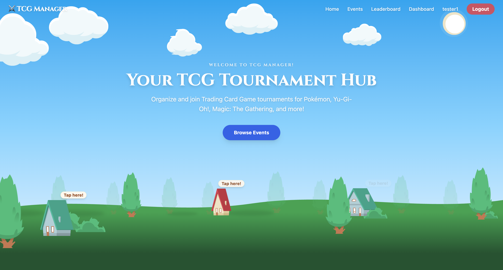
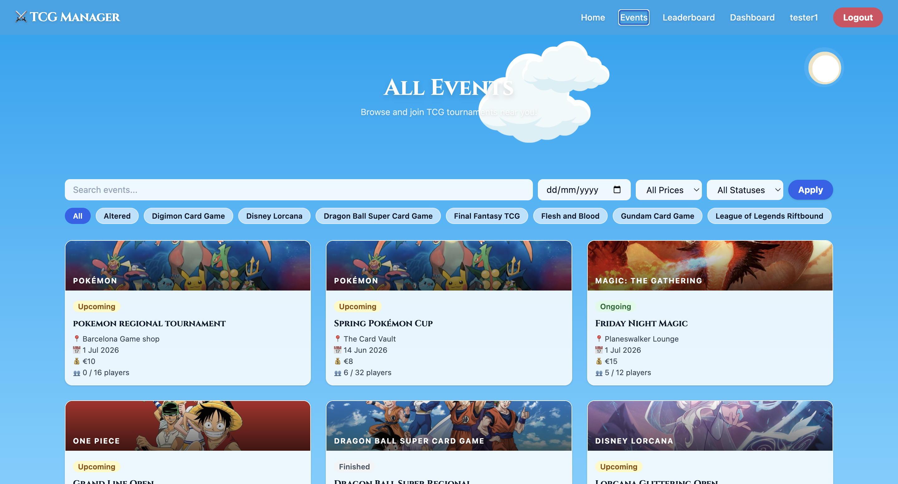
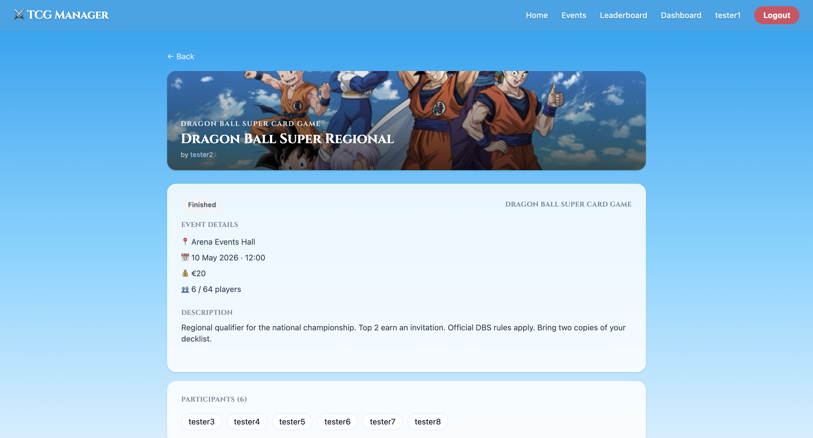
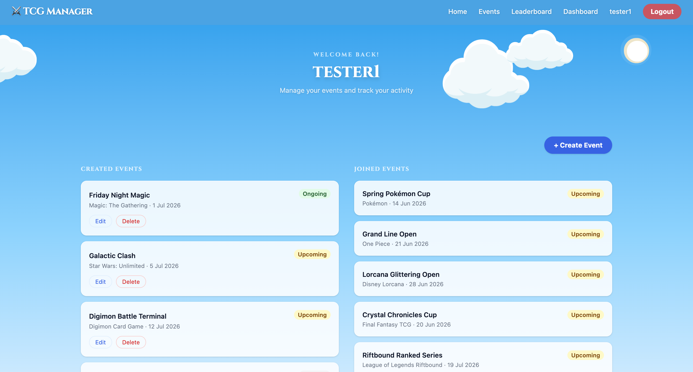
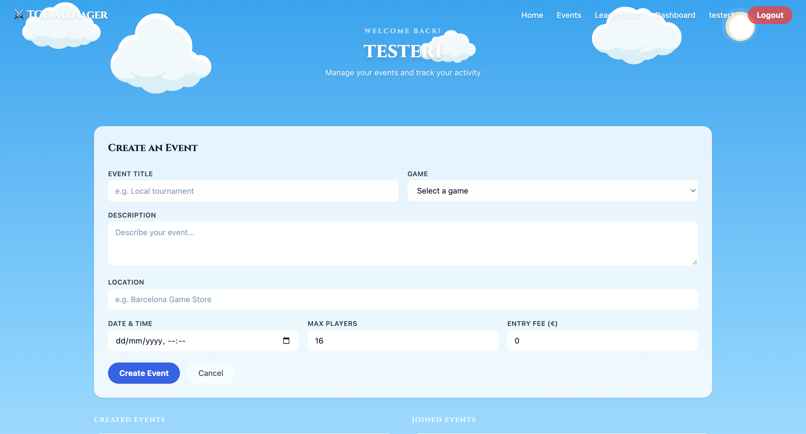
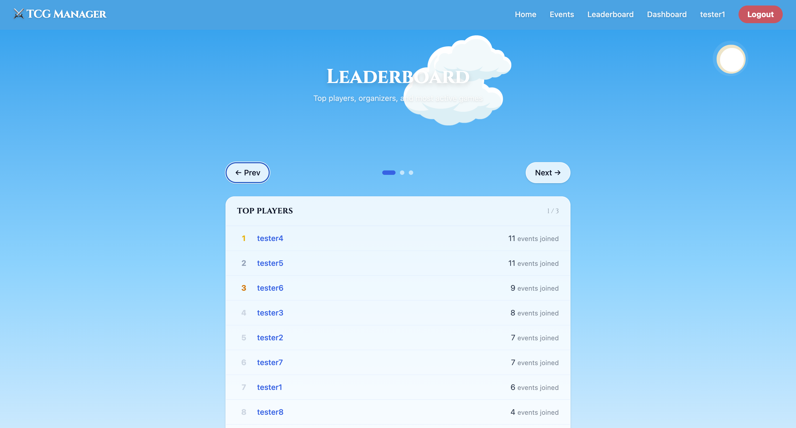
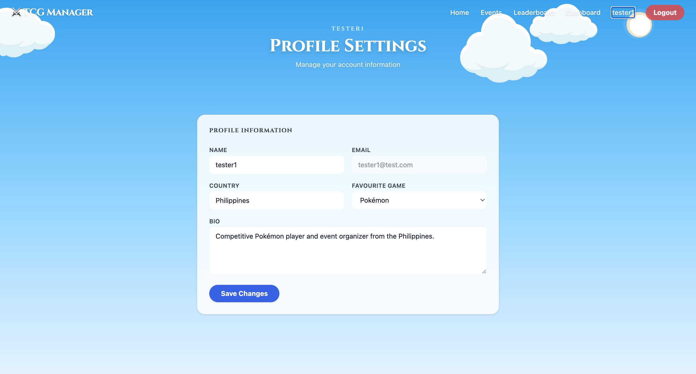
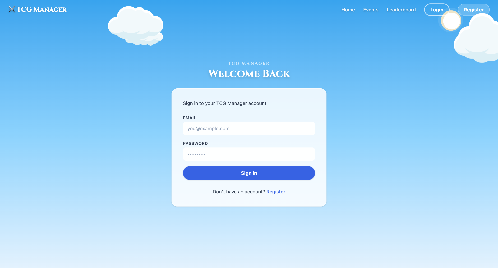

# TCGManager — React Frontend



**TCGManager** is a full-featured single-page application for organizing and joining Trading Card Game tournaments. Built with **React 19 + Vite + Tailwind CSS v4**, it consumes a REST API built in Laravel 13.

Developed as part of **Sprint 5 — IT Academy Barcelona**, using **Claude (Anthropic)** as AI assistant throughout the development process.

> 📄 **AI Documentation (Spanish):** See [AI_DOC.md](AI_DOC.md) for the full AI interaction log, code analysis, and learning reflections required by IT Academy.

---

## Links

- 🔗 **Backend repository (Laravel API):** [Sprint5-1](https://github.com/kentquinto/Sprint5-1)
- 🤖 **AI used:** Claude Sonnet — [Anthropic](https://anthropic.com)

---

## Table of Contents

- [Features](#features)
- [Screenshots](#screenshots)
- [Tech Stack](#tech-stack)
- [Prerequisites](#prerequisites)
- [Getting Started](#getting-started)
- [Docker](#docker)
- [Project Structure](#project-structure)

---

## Features

### Authentication
Register and log in with a Bearer token stored in localStorage. Protected routes automatically redirect unauthenticated users to the login page. Expired tokens are detected globally via an Axios interceptor that clears the session and redirects to `/login`.

### Events
Browse all events with real-time filtering by keyword, date, price, status, and game. Events are displayed in a responsive card grid with game banner images, status badges, and pagination.

### Event Detail
View full event information including location, date, entry fee, and participant count. Authenticated users can join or leave events with a confirmation modal. The event creator can edit or delete their event from the Dashboard.

### Dashboard
Personal panel showing all events the user has created and joined. Includes a full event creation and editing form with validation.

### Leaderboard
Carousel-style ranking tables for top players by events joined, top organizers by events created, and most active games by event count.

### Player Profiles
Public profile pages showing player stats, bio, country, and favourite game.

### Profile Settings
Edit personal information including name, country, bio, and favourite game. Changes reflect immediately in the navbar.

---

## Screenshots

### Homepage

*Interactive 2D scene with animated clouds, houses, and hero text. Houses are clickable and show contextual tooltips.*

### Events

*Browse all events with inline filter bar, game pill navigation, and paginated card grid.*

### Event Detail

*Full event information with game banner, participant list, and join/leave actions.*

### Dashboard

*Personal panel showing created and joined events with edit and delete controls.*

### Create Event

*Event creation form with fields for title, game, description, location, date, max players, and entry fee.*

### Leaderboard

*Carousel leaderboard with dot navigation across top players, top organizers, and most active games.*

### Profile

*Profile settings page with editable name, country, bio, and favourite game.*

### Login

*Login page with animated sky background and Cinzel typography.*

---

## Tech Stack

| Technology | Version | Purpose |
|------------|---------|---------|
| React | 19 | UI library |
| Vite | 8 | Bundler and dev server |
| Tailwind CSS | v4 | Utility-first styling |
| React Router | v7 | Client-side routing |
| Axios | latest | HTTP client for the API |
| Nginx | alpine | Production static file server |
| Docker | — | Containerization |

---

## Prerequisites

Before running the frontend you need the **Laravel backend API** running locally.

1. Clone and set up the backend: [Sprint5-1](https://github.com/kentquinto/Sprint5-1)
2. Follow its README to configure the database and run migrations
3. Start the Laravel dev server:

```bash
php artisan serve
```

The API must be available at `http://localhost:8000` before starting the frontend.

---

## Getting Started

### 1. Clone the repository

```bash
git clone https://github.com/kentquinto/TCGManager-React
cd TCGManager-React
```

### 2. Install dependencies

```bash
npm install
```

### 3. Configure environment

Create a `.env` file in the root of the project:

```env
VITE_API_URL=http://localhost:8000/api
```

### 4. Start the development server

```bash
npm run dev
```

The app will be available at `http://localhost:5173`.

---

## Docker

The project includes a Docker setup to serve the built frontend via Nginx in production. This covers **Level 3** of the Sprint 5 requirements.

### How it works

The Dockerfile uses a **multi-stage build**:

1. **Stage 1 — Build:** A Node.js image installs dependencies and runs `npm run build`, producing the optimised `/dist` folder.
2. **Stage 2 — Serve:** A lightweight Nginx Alpine image copies only the `/dist` folder. Source code and `node_modules` never reach the final image, keeping it small.

Nginx is configured with `try_files $uri $uri/ /index.html` so React Router handles all client-side routes without returning 404 errors.

> **Important:** `VITE_API_URL` is baked into the JavaScript bundle at build time by Vite. To point the containerized frontend at a different backend, pass the URL as a build argument and rebuild the image.

### Run with Docker

```bash
# Using the default API URL (localhost:8000)
docker compose up --build

# Pointing to a deployed backend
VITE_API_URL=https://your-api.com/api docker compose up --build
```

The app will be available at `http://localhost:3000`.

### Docker files

| File | Purpose |
|------|---------|
| `Dockerfile` | Multi-stage build definition |
| `nginx.conf` | SPA routing + static asset caching |
| `docker-compose.yml` | Single-command orchestration |
| `.dockerignore` | Excludes `node_modules`, `.env`, `.git` from the image |

---

## Project Structure

```
src/
├── api/
│   └── axios.js              # Axios instance with auth + 401 interceptors
├── components/
│   ├── ConfirmModal.jsx       # Reusable confirmation dialog
│   ├── EventForm.jsx          # Create / edit event form
│   ├── Navbar.jsx             # Global navigation bar
│   ├── PageScreen.jsx         # Full-screen loading and error state
│   ├── ProtectedRoute.jsx     # Auth guard for private routes
│   ├── SkyBanner.jsx          # Page hero banner with document title
│   ├── SkyPage.jsx            # Full-viewport sky background wrapper
│   └── Toast.jsx              # Auto-dismissing notification
├── context/
│   └── AuthContext.jsx        # Global auth state (token, user, updateUser)
├── pages/
│   ├── DashboardPage.jsx
│   ├── EventDetailPage.jsx
│   ├── EventsPage.jsx
│   ├── HomePage.jsx
│   ├── LoginPage.jsx
│   ├── PlayerProfilePage.jsx
│   ├── ProfilePage.jsx
│   ├── RegisterPage.jsx
│   └── StatsPage.jsx
└── utils/
    ├── formStyles.js          # Shared Tailwind class strings for inputs
    ├── gameImages.js          # Game ID → banner image mapping
    └── statusColors.js        # Status badge colors + capitalize/formatDate
```

---

*Developed by **Kent Quinto** — IT Academy Barcelona, Sprint 5*
